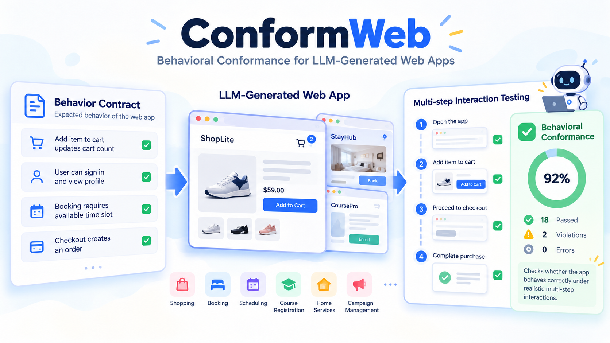

# ConformWeb



> **Do LLM-Generated Web Apps Behave Correctly? A Contract-Grounded Benchmark for Behavioral Conformance**

**Accepted to the EMNLP 2026 Main Conference.**

ConformWeb evaluates whether a web application preserves a public behavioral
contract under multi-step browser interaction. It compiles YAML contracts and
scenarios into deterministic Playwright actions and rule-based assertions. The
evaluator does not use visual similarity, source inspection, or an LLM judge.

This repository is intended to be usable in two ways:

1. Evaluate your own generated or hand-written app against a released target.
2. Reproduce the paper protocol with the released generation prompts, evaluator,
   and aggregate experiment artifacts.

## Quick Start

ConformWeb requires Python 3.11+ and Playwright Chromium.

```bash
git clone https://github.com/deep-diver/ConformWeb.git
cd ConformWeb
python3 -m venv .venv
source .venv/bin/activate
pip install -e ".[dev]"
playwright install chromium
```

Inspect the target inventory and compile one public scenario set without opening
a browser:

```bash
conformweb list-targets
conformweb validate-target \
  --target targets/web/stayflow_concierge/tier_a \
  --scenario-set public
```

Run an end-to-end harness smoke test against the included reference app:

```bash
conformweb evaluate-dsl \
  --target targets/web/stayflow_concierge/tier_a \
  --scenario-set public \
  --static-dir targets/web/stayflow_concierge/tier_a/reference_app \
  --run-subject reference-smoke \
  --output .conformweb-runs/reference-smoke
```

The historical `detoxbench` command and `python -m detoxbench` remain aliases for
the same CLI.

## Evaluate Your App

For a static candidate directory:

```bash
conformweb evaluate-dsl \
  --target targets/web/stayflow_concierge/tier_a \
  --scenario-set public \
  --static-dir /absolute/path/to/candidate \
  --run-subject my-candidate \
  --screenshot-policy failures \
  --output .conformweb-runs/my-candidate-public
```

For a framework or backend-backed app that is already running:

```bash
conformweb evaluate-dsl \
  --target targets/web/stayflow_concierge/tier_a \
  --scenario-set public \
  --app-url http://127.0.0.1:5173 \
  --run-subject my-running-app \
  --screenshot-policy failures \
  --output .conformweb-runs/my-running-app-public
```

Use public scenarios while implementing and debugging. Run `--scenario-set
private` or `--scenario-set all` only after the candidate is fixed. A candidate
must expose the contract's state-probe expression, preserve its declared browser
routes, and render every declared selector as a directly actionable element.

Each run writes:

- `summary.json`: run, scenario, step, score, and first-failure records
- `events.jsonl`: detailed before/after observations for every executed step
- `screenshots/<scenario>/`: before/after browser evidence

`--screenshot-policy failures` removes screenshots for passing steps and keeps
the before/after pair for failed assertions plus any pre-error screenshot.
`--screenshot-policy none` disables capture. The default `all` preserves the
camera-ready evaluation protocol.

The process exits with code `0` for a full pass, `1` for evaluated failures, and
`2` for CLI usage errors. See [`docs/getting-started.md`](docs/getting-started.md)
for the complete workflow and artifact schema.

## Paper Generation Protocol

The single-shot paper protocol gives the model the public contract and disclosed
public scenarios, while withholding private scenarios, evaluator traces,
screenshots, failure feedback, and reference source. It requires exactly
`index.html`, `styles.css`, and `app.js`.

Install the optional OpenAI SDK when generating candidates through the released
runner:

```bash
pip install -e ".[generation]"
python tools/generate_blind_dsl_static_app.py \
  --contract-dsl targets/web/stayflow_concierge/tier_a/contract.dsl.yaml \
  --public-scenarios-dsl targets/web/stayflow_concierge/tier_a/scenarios.public.dsl.yaml \
  --output-dir /absolute/path/to/candidate \
  --variant "clear travel booking workspace" \
  --provider openai \
  --model YOUR_MODEL_ID
```

The backend-backed prompt is in `tools/generate_blind_dsl_backend_app.py`. The
public-feedback repair runner is in
`results_iterative_repair_full_matrix/run_iterative_repair_public_feedback_ad_subset.py`.
Prompt hashes and generation metadata are written alongside generated apps.

## Current Release

The camera-ready study evaluates 24 benchmark instances and 756 scenarios. The
current public evaluator release contains **21 complete targets and 732
scenarios**: 264 public and 468 private. Every released target includes its
contract, public scenarios, private scenarios, and reference app.

`conformweb list-targets` reports this supported release set. Paper aggregates
and provenance artifacts remain available under `reports/` and the retained
experiment-result directories.

## Repository Map

```text
detoxbench/                         evaluator, compiler, scoring, and CLI
targets/web/                        released contracts, scenarios, reference apps
tools/                              generation and experiment runners
docs/getting-started.md             external evaluator workflow
docs/candidate-workflow.md          paper candidate-generation protocol
tests/                              compiler, evaluator, scoring, and release tests
reports/conformweb_visualizations/  paper aggregates and provenance audits
results_backend_backed_target_apps/ compact backend experiment artifacts
results_iterative_repair_full_matrix/ repair runners and accounting snapshots
```

For the primary `6 x 4 x 9 x 10 = 2,160` experiment, model identifiers,
sampling settings, dates, hashes, runtime details, backend accounting, and repair
accounting, see
[`run_accounting_and_provenance_appendix.md`](reports/conformweb_visualizations/run_accounting_and_provenance_appendix.md).

## License And Citation

The code and released artifacts are available under Apache-2.0. Citation
metadata is provided in [`CITATION.cff`](CITATION.cff).
